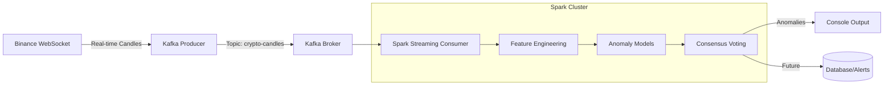

# Real-Time Market Anomaly Detection

A production-ready system for detecting anomalies in cryptocurrency markets using **Kafka**, **Spark Structured Streaming**, and **Unsupervised Learning**.

## 🏗️ Architecture



The system uses a **Sliding Window** approach for dynamic anomaly detection:
1.  **Window**: 1-hour rolling window, sliding every 1 minute.
2.  **Metrics**: Calculates Moving Average and result Standard Deviation for each window.
3.  **Anomaly Detection**: Flags windows where volatility (std dev) exceeds historical norms (> 3 sigma).


## 🚀 Getting Started

### Prerequisites
*   **Docker Desktop** (running)
*   **Python 3.9+** (for local development)

### 1. Start Infrastructure
Start Kafka, Kafka UI, and the Jupyter Spark environment:
```bash
docker-compose up -d
```
*   **Kafka UI**: [http://localhost:8080](http://localhost:8080)
*   **Jupyter**: [http://localhost:8880](http://localhost:8880) (Password: `anomaly`)

### 2. Start the Producer
The producer connects to Binance WebSocket and pushes data to Kafka.

**Option A: Inside Docker (Recommended)**
```bash
# Open a terminal in the Jupyter container
docker exec -it jupyter bash

cd work/src
python kafka_producer.py
```

**Option B: Local Machine**
```bash
# Ensure 'localhost:9092' is accessible
pip install -r requirements.txt
python src/kafka_producer.py
```

### 3. Start the Consumer
The consumer reads from Kafka, applies models, and outputs anomalies.

```bash
# Inside the Jupyter container (same as above)
cd work/src

# Submit the Spark job
spark-submit --packages org.apache.spark:spark-sql-kafka-0-10_2.12:3.5.0 spark_consumer.py
```

## ⚙️ Configuration
Model parameters are **NOT hardcoded**. They are loaded from `src/models/model_params.json`. 

To update thresholds without redeploying code:
1.  Edit `src/models/model_params.json`.
2.  Restart the Spark Consumer.

## 📊 Output Format
The system outputs a stream of processed candles. Look for the `is_anomaly` column:

| Symbol | Close | Return% | Votes | IS_ANOMALY | Confidence | Reasons |
|--------|-------|---------|-------|------------|------------|---------|
| BTCUSDT| 42000 | 0.01%   | 0     | false      | NONE       | |
| ETHUSDT| 2200  | **4.5%**| 3     | **true**   | **HIGH**   | Z-SCORE \| VOLATILITY \| VOLUME |
